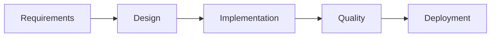

# Squad Architecture Decisions

## Core Philosophy
**"Distributed intelligence through specialized agents with file-based coordination"**

## Key Architectural Decisions

### 1. Supervisor-Worker Separation

#### Decision
Separate orchestration (Supervisor) from implementation (Workers).

#### Rationale
- **Clear boundaries**: Supervisor never writes code, workers never orchestrate
- **Token optimization**: Supervisor uses Opus for complex reasoning, workers use Sonnet/Haiku
- **Scalability**: Can adjust worker count without changing supervisor logic
- **Error isolation**: Supervisor remains stable even if workers fail

#### Trade-offs
- ✅ Clean separation of concerns
- ✅ Easier to debug and monitor
- ❌ Additional coordination overhead
- ❌ Potential communication latency

### 2. File-Based Communication

#### Decision
Use filesystem as message bus instead of APIs or databases.

#### Rationale
- **Simplicity**: No additional infrastructure required
- **Persistence**: Natural audit trail and recovery mechanism
- **Compatibility**: Works with any AI model/platform
- **Debugging**: Human-readable messages for inspection

#### Implementation
```
.squad/sessions/[timestamp]/
├── role-plan-*.md    # Task assignments
├── role-comm-*.md    # Progress updates
└── locks/           # Coordination primitives
```

#### Trade-offs
- ✅ Zero dependencies
- ✅ Built-in persistence
- ✅ Easy debugging
- ❌ Polling overhead
- ❌ File system limits

### 3. Parallel Execution Strategy

#### Decision
Enable parallel execution for independent tasks only.

#### Parallel-Safe Operations
- Different components by multiple frontend-ui-developers
- Frontend and backend development simultaneously
- Design and research in parallel
- Read operations by any number of agents

#### Sequential Requirements
- Code review after implementation
- Enhancement after core features
- Integration testing after all components
- File modifications (lock required)

#### Implementation
```python
# Parallel task allocation
if no_dependencies(task) and no_file_conflicts(task):
    assign_to_available_agent(task)
else:
    queue_for_sequential_processing(task)
```

### 4. Token Optimization Strategies

#### Decision
Use tiered models based on task complexity.

#### Model Assignment
- **Opus (16K tokens)**: Supervisor only - complex orchestration
- **Sonnet (8K tokens)**: Core implementation tasks
- **Haiku (4K tokens)**: Simple enhancements, planning

#### Token Reduction Techniques
1. **Slim Templates**: 97% reduction (37K → 1K tokens)
2. **Focused Context**: Only relevant files per agent
3. **Incremental Updates**: Delta-based progress reports
4. **Shared Boilerplate**: Reusable code examples

#### Measurement
```yaml
token_budget:
  per_task: 8000
  per_session: 100000
  alert_threshold: 80%
```

### 5. File Locking Approach

#### Decision
Pessimistic locking with timeout-based release.

#### Lock Implementation
```bash
# Lock acquisition
lock_file="$1.lock-$AGENT-$(date +%s)"
if [ ! -f "$1.lock-*" ]; then
    echo "$AGENT" > "$lock_file"
    # Auto-release after 2 minutes
    (sleep 120 && rm -f "$lock_file") &
fi
```

#### Conflict Resolution
1. Check for existing locks before write
2. Wait up to 10 seconds for lock release
3. Escalate to supervisor if blocked
4. Supervisor can force-release stale locks

### 6. Phase-Based Execution

#### Decision
Organize work into discrete phases with validation gates.

#### Phases


#### Validation Gates
Each phase must pass specific criteria:
- **Requirements**: User stories with acceptance criteria
- **Design**: Valid CSS classes, API contracts defined
- **Implementation**: Code compiles, tests pass
- **Quality**: Coverage > 80%, no security issues

#### Benefits
- Predictable workflow
- Early error detection
- Clear progress tracking
- Reduced rework

### 7. Agent Specialization

#### Decision
Each agent has exclusive domain ownership.

#### Domain Mapping
```yaml
domains:
  frontend-ui-developer: [frontend/**, components/**]
  backend-system-architect: [backend/**, api/**]
  ai-ml-engineer: [ml/**, prompts/**]
  code-quality-reviewer: [tests/**, *.test.*]
```

#### Enforcement
- Agents cannot modify files outside their domain
- Supervisor validates boundaries before task assignment
- Violations result in task rejection

### 8. Error Recovery Strategy

#### Decision
Fail-fast with supervisor-coordinated recovery.

#### Recovery Flow
1. **Agent detects error** → Reports via role-comm
2. **Supervisor evaluates** → Determines fix strategy
3. **Assigns fix task** → High priority to capable agent
4. **Validates fix** → Ensures error resolved
5. **Resumes workflow** → Continues from checkpoint

#### Retry Limits
- Task retry: 3 attempts
- Agent restart: 2 times
- Session abort: After 5 critical failures

### 9. Session Management

#### Decision
Timestamp-based sessions with automatic archival.

#### Session Lifecycle
```python
def session_lifecycle():
    session_id = create_session()  # timestamp + hash
    try:
        execute_phases(session_id)
        validate_results(session_id)
        archive_session(session_id)
    except CriticalError:
        quarantine_session(session_id)
    finally:
        cleanup_resources(session_id)
```

#### Retention
- Active: Until completion
- Completed: 24 hours then archive
- Archived: 30 days
- Failed: 7 days for debugging

### 10. Performance Monitoring

#### Decision
Built-in metrics collection without external tools.

#### Metrics Collected
```yaml
per_agent:
  - tasks_completed
  - success_rate
  - avg_completion_time
  - tokens_consumed
  
per_session:
  - total_duration
  - phases_completed
  - validation_gates_passed
  - parallel_speedup
```

#### Optimization Triggers
- Token usage > 80% budget → Switch to Haiku
- Task failure > 25% → Review agent assignment
- Lock contention > 10% → Reduce parallelism

## Future Considerations

### Potential Enhancements
1. **WebSocket communication** - Real-time instead of polling
2. **Distributed execution** - Multi-machine agent deployment
3. **Smart caching** - Reuse previous task outputs
4. **Dynamic scaling** - Adjust agent count based on load

### Rejected Approaches
1. ❌ **Database message queue** - Too complex
2. ❌ **Direct agent-to-agent** - Loss of supervision
3. ❌ **Shared memory** - Platform dependencies
4. ❌ **Complex state machines** - Maintenance burden

## Success Metrics

### Target Performance
- **Parallel speedup**: 1.5-2x vs sequential
- **First-time success**: > 75% of tasks
- **Token efficiency**: < 100K per feature
- **Session completion**: > 90% success rate

### Monitoring
```bash
# Generate performance report
.squad/scripts/analyze-session.sh [session-id]
```

## Conclusion

This architecture prioritizes:
1. **Simplicity** over feature richness
2. **Reliability** over performance
3. **Debuggability** over elegance
4. **Token efficiency** over convenience

The result is a robust, maintainable system for coordinating AI agents that can deliver complex features through specialized, parallel execution.