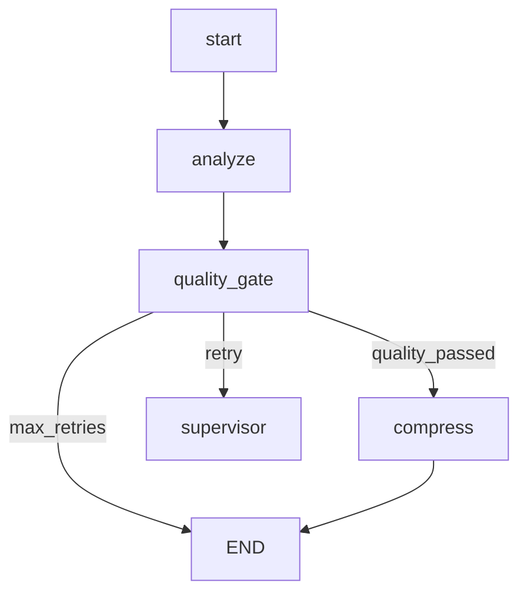

# Conditional Routing in LangGraph

## Overview

**Conditional routing** lets you dynamically choose the next node based on the current state.

**Use cases:**
- Quality gates (pass → publish, fail → retry)
- Content-based routing (tutorial → tutorial_agent, code → code_agent)
- Loop control (continue → loop, done → exit)
- Error handling (success → next, error → fallback)

---

## Basic Conditional Edge

```python
from langgraph.graph import StateGraph, END

def route_function(state: WorkflowState) -> str:
    """Decide next node based on state."""
    if state["score"] >= 0.8:
        return "success_path"
    else:
        return "retry_path"

workflow = StateGraph(WorkflowState)
workflow.add_node("check", check_quality)
workflow.add_node("success_path", success_handler)
workflow.add_node("retry_path", retry_handler)

# Add conditional edge
workflow.add_conditional_edges(
    "check",  # Source node
    route_function,  # Routing function
    {
        "success_path": "success_path",  # Map return value to node
        "retry_path": "retry_path"
    }
)
```

**How it works:**
1. `check` node executes
2. `route_function` reads state, returns string
3. String is mapped to next node
4. Next node executes

---

## SkillForge's Quality Gate Router

```python
# backend/app/workflows/nodes/quality_gate_node.py

def route_after_quality_gate(state: AnalysisState) -> str:
    """Route based on quality assessment."""

    # Quality passed → compress and finish
    if state["quality_passed"]:
        return "compress_findings"

    # Quality failed, but can retry
    elif state["retry_count"] < 2:
        logger.warning(
            "Quality gate failed, retrying",
            retry_count=state["retry_count"],
            quality_score=state["quality_score"]
        )
        state["retry_count"] += 1
        return "supervisor"  # Run more agents

    # Quality failed, exceeded retries
    else:
        logger.error(
            "Quality gate failed after max retries",
            retry_count=state["retry_count"],
            quality_score=state["quality_score"]
        )
        return END  # Give up, return partial results

# Add conditional routing
workflow.add_conditional_edges(
    "quality_gate",
    route_after_quality_gate,
    {
        "compress_findings": "compress_findings",
        "supervisor": "supervisor",
        END: END
    }
)
```

**Routing Decision Tree:**
```
Quality Gate
    ├─ PASS (score ≥ 0.7) ────────────→ compress_findings
    │
    ├─ FAIL + retries < 2 ────────────→ supervisor (retry)
    │
    └─ FAIL + retries ≥ 2 ────────────→ END (give up)
```

---

## Common Routing Patterns

### Pattern 1: Binary Decision (Pass/Fail)

```python
def route_validation(state):
    """Simple pass/fail routing."""
    return "pass" if state["valid"] else "fail"

workflow.add_conditional_edges(
    "validate",
    route_validation,
    {
        "pass": "next_step",
        "fail": "error_handler"
    }
)
```

### Pattern 2: Multi-Way Branching

```python
def route_by_content_type(state):
    """Route to specialist based on content."""
    content_type = detect_type(state["content"])

    if content_type == "code":
        return "code_analyzer"
    elif content_type == "tutorial":
        return "tutorial_analyzer"
    elif content_type == "research":
        return "research_analyzer"
    else:
        return "general_analyzer"

workflow.add_conditional_edges(
    "classifier",
    route_by_content_type,
    {
        "code_analyzer": "code_analyzer",
        "tutorial_analyzer": "tutorial_analyzer",
        "research_analyzer": "research_analyzer",
        "general_analyzer": "general_analyzer"
    }
)
```

### Pattern 3: Loop Control

```python
def route_iteration(state):
    """Loop until condition met."""
    if state["iterations"] >= 5:
        return "exit"  # Max iterations reached
    elif state["converged"]:
        return "exit"  # Converged early
    else:
        return "continue"  # Keep iterating

workflow.add_conditional_edges(
    "check_convergence",
    route_iteration,
    {
        "continue": "process",  # Loop back
        "exit": "finalize"
    }
)

# Create loop
workflow.add_edge("process", "check_convergence")
```

### Pattern 4: Priority Routing

```python
def route_by_priority(state):
    """Route to first available handler."""
    if state["has_security_issue"]:
        return "security_handler"  # Highest priority
    elif state["has_performance_issue"]:
        return "performance_handler"
    elif state["has_style_issue"]:
        return "style_handler"
    else:
        return "done"

workflow.add_conditional_edges(
    "analyzer",
    route_by_priority,
    {
        "security_handler": "security_handler",
        "performance_handler": "performance_handler",
        "style_handler": "style_handler",
        "done": END
    }
)
```

---

## Complex Routing Logic

### Scenario: Multi-Factor Routing

```python
def complex_router(state: AnalysisState) -> str:
    """Route based on multiple factors."""

    # Factor 1: Quality score
    quality_ok = state["quality_score"] >= 0.7

    # Factor 2: Token usage
    tokens_ok = state["total_tokens"] < 10000

    # Factor 3: Time budget
    time_ok = state["elapsed_time"] < 60  # seconds

    # Decision matrix
    if quality_ok and tokens_ok and time_ok:
        return "success"  # Perfect!

    elif quality_ok and not tokens_ok:
        return "compress"  # Good quality but too long

    elif not quality_ok and time_ok:
        return "retry"  # Low quality but time remaining

    elif not quality_ok and not time_ok:
        return "partial_success"  # Out of time, use partial

    else:
        return "failure"  # Can't proceed

workflow.add_conditional_edges(
    "evaluate",
    complex_router,
    {
        "success": "publish",
        "compress": "compressor",
        "retry": "regenerate",
        "partial_success": "partial_handler",
        "failure": "error_handler"
    }
)
```

---

## Routing with State Updates

**Important:** Routing function should be **read-only** (no state updates).

```python
# WRONG - Updates state in routing function
def bad_router(state):
    state["routed_at"] = datetime.now()  # DON'T DO THIS
    return "next"

# CORRECT - Update state in nodes, not routing
def good_router(state):
    # Only read state
    return "next" if state["ready"] else "wait"

def node_before_routing(state):
    # Update state here
    state["routed_at"] = datetime.now()
    return state
```

**Why?** Routing functions are called during graph compilation and can execute multiple times.

---

## Dynamic END Routing

```python
from langgraph.graph import END

def route_to_end(state):
    """Conditionally end workflow."""
    if state["done"]:
        return END  # Special constant
    else:
        return "continue"

workflow.add_conditional_edges(
    "check",
    route_to_end,
    {
        "continue": "next_step",
        END: END  # Map to END constant
    }
)
```

**When to use END:**
- Early termination (found answer, no need to continue)
- Error exit (unrecoverable failure)
- Budget exhausted (time, tokens, cost)

---

## Testing Conditional Routing

```python
import pytest

def test_quality_gate_routes_correctly():
    """Test quality gate routing logic."""

    # High quality → compress
    state = {"quality_passed": True, "retry_count": 0}
    assert route_after_quality_gate(state) == "compress_findings"

    # Low quality, can retry → supervisor
    state = {"quality_passed": False, "retry_count": 0}
    assert route_after_quality_gate(state) == "supervisor"

    # Low quality, max retries → END
    state = {"quality_passed": False, "retry_count": 2}
    assert route_after_quality_gate(state) == END

def test_routing_function_is_pure():
    """Test that routing doesn't modify state."""
    original_state = {"score": 0.5}
    state_copy = original_state.copy()

    route_function(original_state)

    # State should be unchanged
    assert original_state == state_copy
```

---

## Visualizing Conditional Routes

```python
from langgraph.graph import StateGraph

workflow = StateGraph(State)
# ... add nodes and edges ...

# Generate Mermaid diagram
mermaid = workflow.get_graph().draw_mermaid()
print(mermaid)
```

**Example Output:**


---

## Common Pitfalls

### Pitfall 1: Missing Route Case

```python
# WRONG - Doesn't handle all cases
def bad_router(state):
    if state["score"] > 0.8:
        return "high_quality"
    elif state["score"] > 0.5:
        return "medium_quality"
    # What if score ≤ 0.5? Returns None → ERROR

# CORRECT - Handle all cases
def good_router(state):
    if state["score"] > 0.8:
        return "high_quality"
    elif state["score"] > 0.5:
        return "medium_quality"
    else:
        return "low_quality"  # Default case
```

### Pitfall 2: Unmapped Return Value

```python
def router(state):
    return "success"  # Returns "success"

# WRONG - Mapping doesn't include "success"
workflow.add_conditional_edges(
    "node",
    router,
    {
        "pass": "next_node"  # Missing "success" → ERROR
    }
)

# CORRECT - Map all possible return values
workflow.add_conditional_edges(
    "node",
    router,
    {
        "success": "next_node"
    }
)
```

### Pitfall 3: Infinite Loops

```python
# WRONG - Can loop forever
def router(state):
    if state["score"] < 0.8:
        return "retry"  # Always retries if score low
    else:
        return "done"

workflow.add_conditional_edges("check", router, {
    "retry": "generate",  # Might never improve
    "done": END
})
workflow.add_edge("generate", "check")  # Loop

# CORRECT - Add loop limit
def router(state):
    if state["score"] < 0.8 and state["retries"] < 3:
        state["retries"] += 1
        return "retry"
    else:
        return "done"  # Exit after 3 retries
```

---

## Performance Considerations

### Routing Function Performance

**Routing functions are called frequently** (every time source node completes).

```python
# SLOW - Expensive computation in routing
def slow_router(state):
    result = expensive_analysis(state["data"])  # 5 seconds
    return "next" if result > 0.5 else "other"

# FAST - Pre-compute in node
def node_with_analysis(state):
    state["analysis_result"] = expensive_analysis(state["data"])
    return state

def fast_router(state):
    return "next" if state["analysis_result"] > 0.5 else "other"
```

**Rule:** Do expensive work in nodes, not routing functions.

---

## Advanced: Conditional Edges with Send API

```python
from langgraph.graph import Send

def dynamic_fan_out(state):
    """Send to multiple nodes based on state."""
    tasks = state["tasks"]

    # Return list of Send objects
    return [
        Send("worker", {"task": task})
        for task in tasks
        if task["priority"] > 5  # Conditional!
    ]

workflow.add_conditional_edges("dispatcher", dynamic_fan_out)
```

**Use case:** Fan out to variable number of workers based on state.

---

## References

- [LangGraph Conditional Edges](https://langchain-ai.github.io/langgraph/how-tos/branching/)
- [Quality Gate Pattern](https://langchain-ai.github.io/langgraph/tutorials/branching/)
- SkillForge: `backend/app/workflows/nodes/quality_gate_node.py`
