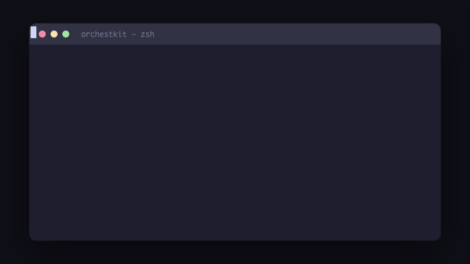
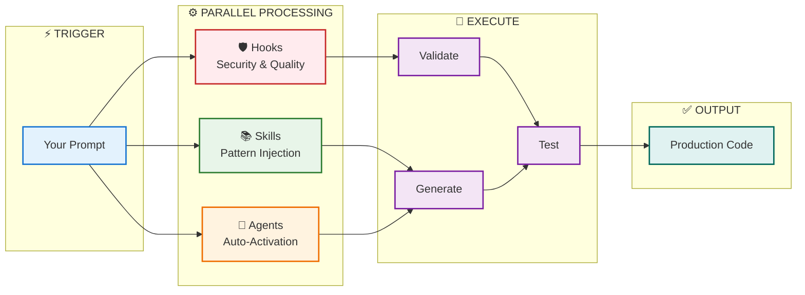
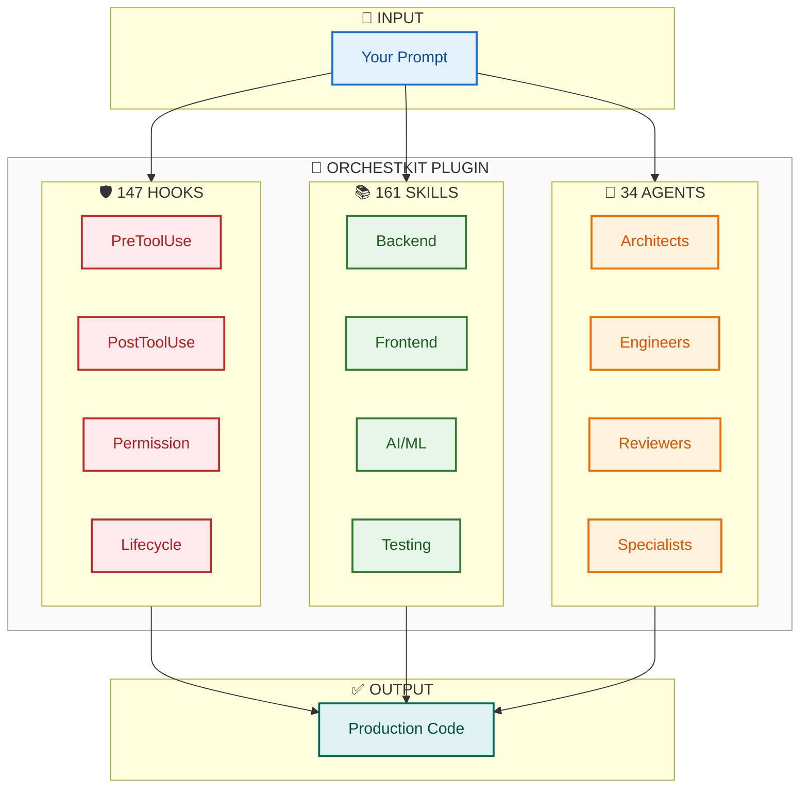

<!-- markdownlint-disable MD033 MD041 -->
<div align="center">

# OrchestKit Claude Plugin

### Stop explaining your stack. Start shipping.

**163 skills · 34 agents · 144 hooks · 33 modular plugins**

[](https://claude.ai/claude-code)
[](./skills)
[](./agents)
[](./hooks)
[](./LICENSE)
[](https://github.com/yonatangross/orchestkit)

[Why OrchestKit?](#why-orchestkit) · [Quick Start](#quick-start) · [Commands](#commands) · [Skills](#skills) · [Agents](#agents) · [FAQ](#faq)

</div>

---

<!-- Demo GIF placeholder - see issue #187 -->
<!-- <p align="center"></p> -->

## Quick Start

```bash
# Install in 30 seconds
/plugin marketplace add yonatangross/orchestkit
/plugin install ork

# Verify installation
/ork:doctor
```

**That's it.** Skills auto-activate based on your prompts. Hooks protect your code automatically.

---

## Why OrchestKit?

**The Problem:** Every Claude Code session starts from zero. You explain your stack, your patterns, your preferences—again and again.

**The Solution:** OrchestKit gives Claude persistent knowledge of 163 production patterns, 34 specialized agents, and 144 security/quality hooks that work automatically.

<table>
<tr>
<td width="50%">

**Without OrchestKit**
```
😩 "Use FastAPI with async SQLAlchemy 2.0..."
😩 "Remember cursor pagination, not offset..."
😩 "Don't commit to main branch..."
😩 "Run tests before committing..."
```

</td>
<td width="50%">

**With OrchestKit**
```
✨ "Create an API endpoint" → Done right
✨ Agents know your patterns already
✨ Hooks block bad commits automatically
✨ /ork:commit runs tests for you
```

</td>
</tr>
</table>

---

## How It Works

```
                                   YOUR PROMPT
                                       │
                 ┌─────────────────────┼─────────────────────┐
                 │                     │                     │
                 ▼                     ▼                     ▼
        ┌───────────────┐    ┌───────────────┐    ┌───────────────┐
        │   🛡️ HOOKS     │    │   📚 SKILLS   │    │   🤖 AGENTS   │
        │               │    │               │    │               │
        │ Security gate │    │ Pattern libs  │    │ Specialists   │
        │ Git protect   │    │ Best practice │    │ Auto-activate │
        │ Quality check │    │ Code templates│    │ Domain expert │
        │               │    │               │    │               │
        │   144 hooks   │    │  163 skills   │    │   34 agents   │
        └───────┬───────┘    └───────┬───────┘    └───────┬───────┘
                │                    │                    │
                │    ┌───────────────┴───────────────┐    │
                │    │                               │    │
                ▼    ▼                               ▼    ▼
        ┌─────────────────────────────────────────────────────┐
        │                                                     │
        │             ✅ PRODUCTION-READY CODE                │
        │                                                     │
        │   • Follows your stack's patterns                   │
        │   • Security validated                              │
        │   • Tests included                                  │
        │   • Ready to commit                                 │
        │                                                     │
        └─────────────────────────────────────────────────────┘
```

### Lifecycle Flow



---

## See It In Action

```bash
# Commit with automatic validation
/ork:commit
```
```
✓ Pre-commit checks passed
✓ Tests: 42 passed
✓ Security scan: clean
✓ Commit created: feat(api): add user endpoint
```

```bash
# Verify your implementation works
/ork:verify
```
```
Running 3 verification agents in parallel...
├─ test-generator: 4 tests added, coverage 67% → 82%
├─ security-auditor: No vulnerabilities found
└─ code-quality-reviewer: LGTM, minor suggestions noted
```

```bash
# Explore unfamiliar codebase
/ork:explore
```
```
Codebase Analysis:
├─ Backend: FastAPI + SQLAlchemy 2.0 (12 endpoints)
├─ Frontend: React 19 + Vite (23 components)
├─ Database: PostgreSQL + pgvector
└─ Key patterns: Cursor pagination, JWT auth, SSE events
```

---

## Modular Plugins

**33 domain-specific plugins** — install only what you need:

```
┌─────────────────────────────────────────────────────────────────────────────┐
│                         PLUGIN ARCHITECTURE                                 │
├─────────────────────────────────────────────────────────────────────────────┤
│                                                                             │
│   ┌─────────────────────────────────────────────────────────────────────┐   │
│   │                    orchestkit-complete                              │   │
│   │              Full toolkit: all 33 plugins                           │   │
│   └─────────────────────────────────────────────────────────────────────┘   │
│                                    │                                        │
│            ┌───────────────────────┼───────────────────────┐                │
│            ▼                       ▼                       ▼                │
│   ┌─────────────────┐    ┌─────────────────┐    ┌─────────────────┐        │
│   │   🧠 AI/LLM     │    │   ⚡ Backend    │    │   🎨 Frontend   │        │
│   │   7 plugins     │    │   6 plugins     │    │   4 plugins     │        │
│   │                 │    │                 │    │                 │        │
│   │ • ork-rag       │    │ • ork-fastapi   │    │ • ork-react-core│        │
│   │ • ork-langgraph │    │ • ork-database  │    │ • ork-ui-design │        │
│   │ • ork-llm-*     │    │ • ork-async     │    │ • ork-frontend-*│        │
│   └─────────────────┘    └─────────────────┘    └─────────────────┘        │
│                                                                             │
│   ┌─────────────────┐    ┌─────────────────┐    ┌─────────────────┐        │
│   │   🧪 Testing    │    │   🔒 Security   │    │   🚀 DevOps     │        │
│   │   2 plugins     │    │   1 plugin      │    │   3 plugins     │        │
│   │                 │    │                 │    │                 │        │
│   │ • ork-testing-* │    │ • ork-security  │    │ • ork-cicd      │        │
│   │ • ork-e2e       │    │                 │    │ • ork-git       │        │
│   └─────────────────┘    └─────────────────┘    └─────────────────┘        │
│                                                                             │
└─────────────────────────────────────────────────────────────────────────────┘
```

### Installation Options

```bash
# Full toolkit (recommended for new users)
/plugin install ork@orchestkit

# Individual domains (advanced)
/plugin install ork-core@orchestkit           # Core foundation (required)
/plugin install ork-rag@orchestkit            # RAG & retrieval
/plugin install ork-fastapi@orchestkit        # FastAPI backend
/plugin install ork-react-core@orchestkit     # React frontend
/plugin install ork-testing-core@orchestkit   # Testing patterns
```

<details>
<summary><strong>📦 All 33 Plugins by Category</strong></summary>

| Category | Plugins | Description |
|----------|---------|-------------|
| **Core** | `ork-core`, `ork-context`, `ork-memory` | Foundation, context management, persistence |
| **AI/LLM** | `ork-rag`, `ork-rag-advanced`, `ork-langgraph-core`, `ork-langgraph-advanced`, `ork-llm-core`, `ork-llm-advanced`, `ork-ai-observability` | RAG, agents, LLM patterns (7 plugins) |
| **Backend** | `ork-fastapi`, `ork-database`, `ork-async`, `ork-architecture`, `ork-backend-advanced`, `ork-graphql` | APIs, databases, async (6 plugins) |
| **Frontend** | `ork-react-core`, `ork-ui-design`, `ork-frontend-performance`, `ork-frontend-advanced` | React, UI, performance (4 plugins) |
| **Testing** | `ork-testing-core`, `ork-testing-e2e` | Unit, integration, E2E (2 plugins) |
| **Security** | `ork-security` | OWASP, auth, validation, guardrails |
| **DevOps** | `ork-cicd`, `ork-infrastructure`, `ork-git` | CI/CD, infra, git workflows (3 plugins) |
| **Data** | `ork-data-engineering`, `ork-evaluation` | ETL, embeddings, golden datasets (2 plugins) |
| **Workflows** | `ork-workflows-core`, `ork-workflows-advanced` | Implementation, verification flows (2 plugins) |
| **Other** | `ork-accessibility`, `ork-mcp`, `ork-product` | A11y, MCP servers, product management (3 plugins) |

</details>

---

## Commands

**21 slash commands** organized by workflow:

### 🔧 Git & Development

| Command | Description |
|---------|-------------|
| `/ork:commit` | Conventional commit with pre-commit checks |
| `/ork:create-pr` | Create PR with summary and test plan |
| `/ork:review-pr` | Code review checklist |
| `/ork:git-recovery-command` | Recover from git mistakes |

### 🧠 Memory & Context

| Command | Description |
|---------|-------------|
| `/ork:remember` | Save information to persistent memory |
| `/ork:recall` | Retrieve from memory |
| `/ork:load-context` | Load relevant memories at session start |
| `/ork:mem0-sync` | Sync memories to Mem0 cloud |

### 🔍 Analysis & Implementation

| Command | Description |
|---------|-------------|
| `/ork:explore` | Analyze codebase structure |
| `/ork:implement` | Implement feature with agent guidance |
| `/ork:verify` | Verify implementation correctness |
| `/ork:fix-issue` | Fix a GitHub issue |

### ⚙️ Configuration & Health

| Command | Description |
|---------|-------------|
| `/ork:doctor` | Check plugin health |
| `/ork:configure` | Setup MCP servers |

### 📋 Other Workflows

| Command | Description |
|---------|-------------|
| `/ork:brainstorming` | Structured ideation session |
| `/ork:feedback` | Submit feedback or suggestions |
| `/ork:add-golden` | Add golden test dataset |
| `/ork:skill-evolution` | Evolve skills based on usage |
| `/ork:worktree-coordination` | Coordinate multiple Claude instances |

---

## Skills

**163 skills** with progressive loading (~70% token savings):

### 🤖 AI & ML — 27 skills

| Category | Count | Key Skills |
|----------|-------|------------|
| **RAG & Retrieval** | 6 | `rag-retrieval`, `contextual-retrieval`, `reranking-patterns`, `hyde-retrieval`, `query-decomposition`, `agentic-rag-patterns` |
| **LLM Patterns** | 8 | `function-calling`, `llm-streaming`, `llm-evaluation`, `prompt-engineering-suite`, `fine-tuning-customization`, `vision-language-models`, `high-performance-inference`, `semantic-caching` |
| **Agents & Orchestration** | 7 | `agent-loops`, `multi-agent-orchestration`, `langgraph-*` (7 skills), `alternative-agent-frameworks` |
| **Safety & Security** | 6 | `llm-safety-patterns`, `advanced-guardrails`, `mcp-security-hardening`, `llm-testing` |

### ⚡ Backend — 19 skills

| Category | Count | Key Skills |
|----------|-------|------------|
| **FastAPI & Async** | 4 | `fastapi-advanced`, `asyncio-advanced`, `sqlalchemy-2-async`, `connection-pooling` |
| **Task Processing** | 3 | `celery-advanced`, `temporal-io`, `background-jobs` |
| **APIs & Communication** | 3 | `strawberry-graphql`, `grpc-python`, `streaming-api-patterns` |
| **Architecture** | 5 | `saga-patterns`, `cqrs-patterns`, `event-sourcing`, `outbox-pattern`, `aggregate-patterns` |
| **Resilience** | 4 | `rate-limiting`, `idempotency-patterns`, `distributed-locks`, `resilience-patterns` |

### 🎨 Frontend — 23 skills

| Category | Count | Key Skills |
|----------|-------|------------|
| **React & State** | 6 | `react-server-components-framework`, `zustand-patterns`, `tanstack-query-advanced`, `form-state-patterns` |
| **Performance** | 5 | `core-web-vitals`, `lazy-loading-patterns`, `image-optimization`, `render-optimization` |
| **UI & Animation** | 6 | `view-transitions`, `scroll-driven-animations`, `motion-animation-patterns`, `radix-primitives`, `shadcn-patterns` |
| **Data Viz & PWA** | 4 | `recharts-patterns`, `dashboard-patterns`, `pwa-patterns`, `responsive-patterns` |
| **Build & Quality** | 2 | `vite-advanced`, `biome-linting` |

### 🧪 Testing — 10 skills

| Category | Count | Key Skills |
|----------|-------|------------|
| **Unit & Integration** | 4 | `pytest-advanced`, `unit-testing`, `integration-testing`, `msw-mocking` |
| **Advanced Testing** | 4 | `property-based-testing`, `contract-testing`, `e2e-testing`, `vcr-http-recording` |
| **Test Data** | 2 | `test-data-management`, `golden-dataset-*` (3 skills) |

### 🔒 Security — 5 skills

`owasp-top-10` · `auth-patterns` · `input-validation` · `defense-in-depth` · `security-scanning`

### 🚀 DevOps & Git — 10 skills

`github-operations` · `git-workflow` · `stacked-prs` · `release-management` · `observability-monitoring` · `devops-deployment` · `zero-downtime-migration` · `database-versioning` · `alembic-migrations`

<details>
<summary><strong>📁 View all 163 skills</strong></summary>

```bash
ls skills/
```

Full list in [`skills/`](./skills) directory.

</details>

---

## Agents

**34 specialized agents** organized by domain:

### ⚡ Backend & Data — 6 agents

| Agent | Specialty |
|-------|-----------|
| `backend-system-architect` | REST/GraphQL APIs, microservices, clean architecture |
| `database-engineer` | PostgreSQL, pgvector, schema design, migrations |
| `event-driven-architect` | Event sourcing, CQRS, message queues |
| `data-pipeline-engineer` | ETL, data flows, batch processing |
| `python-performance-engineer` | Async optimization, profiling, caching |
| `infrastructure-architect` | Cloud architecture, scaling patterns |

### 🎨 Frontend & UX — 5 agents

| Agent | Specialty |
|-------|-----------|
| `frontend-ui-developer` | React 19, TypeScript, component architecture |
| `rapid-ui-designer` | Quick prototypes, design systems |
| `performance-engineer` | Core Web Vitals, bundle optimization |
| `accessibility-specialist` | WCAG 2.2, ARIA, keyboard navigation |
| `ux-researcher` | User flows, usability analysis |

### 🤖 AI & ML — 5 agents

| Agent | Specialty |
|-------|-----------|
| `llm-integrator` | LLM APIs, prompt design, token optimization |
| `workflow-architect` | LangGraph, multi-agent orchestration |
| `ai-safety-auditor` | Guardrails, prompt injection defense |
| `prompt-engineer` | Chain-of-thought, few-shot learning |
| `multimodal-specialist` | Vision, audio, multi-modal pipelines |

### 🔒 Security — 2 agents

| Agent | Specialty |
|-------|-----------|
| `security-auditor` | OWASP Top 10, vulnerability assessment |
| `security-layer-auditor` | Defense-in-depth, authentication flows |

### ✅ Quality & Testing — 4 agents

| Agent | Specialty |
|-------|-----------|
| `test-generator` | Unit/integration tests, MSW, coverage |
| `code-quality-reviewer` | Code review, best practices, refactoring |
| `system-design-reviewer` | Architecture review, trade-offs |
| `debug-investigator` | Root cause analysis, debugging |

### 🚀 DevOps & Ops — 6 agents

| Agent | Specialty |
|-------|-----------|
| `ci-cd-engineer` | GitHub Actions, deployment pipelines |
| `deployment-manager` | Release coordination, rollback strategies |
| `release-engineer` | Versioning, changelogs, release automation |
| `git-operations-engineer` | Branch strategies, merge workflows |
| `monitoring-engineer` | Prometheus, Grafana, alerting |
| `metrics-architect` | Observability, KPIs, dashboards |

### 📊 Product & Strategy — 5 agents

| Agent | Specialty |
|-------|-----------|
| `product-strategist` | Feature prioritization, roadmaps |
| `business-case-builder` | ROI analysis, business justification |
| `market-intelligence` | Competitive analysis, trends |
| `prioritization-analyst` | Backlog management, impact scoring |
| `requirements-translator` | Specs to implementation plans |

### 📝 Documentation — 1 agent

| Agent | Specialty |
|-------|-----------|
| `documentation-specialist` | API docs, READMEs, technical writing |

---

## Architecture



### Directory Structure

```
orchestkit/
├── .claude-plugin/
│   └── marketplace.json     # 33 modular plugins
├── plugins/                 # Modular plugin bundles
│   └── ork-<domain>/        # Domain-specific plugin
│       ├── .claude-plugin/
│       │   └── plugin.json  # Plugin manifest
│       ├── commands/        # Slash commands
│       ├── agents/          # Specialized agents
│       ├── skills/          # Knowledge modules
│       └── scripts/         # Hook executables
├── skills/                  # 161 knowledge modules (full)
│   └── <skill-name>/
│       ├── SKILL.md         # Overview + patterns (~500 tokens)
│       ├── references/      # Deep-dive guides (~200 tokens)
│       ├── scripts/         # Executable code and generators
│       └── assets/          # Templates and copyable files
├── agents/                  # 34 specialized agents
├── commands/                # 21 slash commands
├── hooks/                   # 147 lifecycle hooks
└── tests/                   # Validation suite
```

---

## Comparison

| Feature | OrchestKit | [claude-code-showcase](https://github.com/ChrisWiles/claude-code-showcase) | DIY Hooks |
|---------|:----------:|:--------------------:|:---------:|
| **Skills/Patterns** | ✅ 161 | ⚠️ ~10 | ❌ 0 |
| **Specialized Agents** | ✅ 34 | ⚠️ ~5 | ❌ 0 |
| **Security Layers** | ✅ 8-layer | ⚠️ Basic | ❌ Manual |
| **AI/ML Patterns** | ✅ 27 | ⚠️ Limited | ❌ None |
| **Testing Patterns** | ✅ 10 | ⚠️ Basic | ❌ None |
| **Setup Time** | ✅ 2 min | ⚠️ 5 min | ❌ Hours |
| **Maintenance** | ✅ Auto | ❌ Manual | ❌ Manual |
| **Progressive Loading** | ✅ Yes | ❌ No | ❌ No |
| **Memory Integration** | ✅ Graph + Mem0 | ❌ None | ❌ None |

---

## Configuration

### MCP Servers (Optional)

```bash
/ork:configure
```

| Server | Purpose | When Active |
|--------|---------|:-----------:|
| **Context7** | Up-to-date library docs | ✅ Until 75% context |
| **Memory** | Knowledge graph (PRIMARY) | ✅ Until 90% context |
| **Sequential Thinking** | Complex reasoning | ✅ Until 60% context |
| **Mem0** | Semantic search (optional) | ⚙️ Requires API key |

**Browser Automation:** Use `agent-browser` CLI via Bash (93% less context than MCP).

### Environment Variables

```bash
CLAUDE_PROJECT_DIR      # Your project directory
CLAUDE_PLUGIN_ROOT      # Plugin installation path
CLAUDE_SESSION_ID       # Current session ID
MEM0_API_KEY            # Optional: Mem0 cloud integration
```

---

## FAQ

<details>
<summary><strong>❓ Plugin not found after installation?</strong></summary>

```bash
# Verify installation
/plugin list

# Reinstall if needed
/plugin uninstall skf
/plugin marketplace add yonatangross/orchestkit
/plugin install ork
```

</details>

<details>
<summary><strong>❓ Hooks not firing?</strong></summary>

1. Check hook logs: `tail -f hooks/logs/*.log`
2. Verify settings: Check `.claude/settings.json` exists
3. Run diagnostics: `/ork:doctor`

</details>

<details>
<summary><strong>❓ How do I add my own skills?</strong></summary>

```bash
mkdir -p skills/my-skill/references

cat > skills/my-skill/SKILL.md << 'EOF'
---
name: my-skill
description: What this skill provides
tags: [keyword1, keyword2]
---

# My Skill
Overview of patterns...
EOF

./tests/skills/structure/test-skill-md.sh
```

</details>

<details>
<summary><strong>❓ Works with existing projects?</strong></summary>

Yes! OrchestKit is additive—it won't modify your files. Skills and agents activate automatically based on context.

</details>

<details>
<summary><strong>❓ How much context does this use?</strong></summary>

**Progressive loading** minimizes usage:
| Stage | Tokens | When |
|-------|--------|------|
| Discovery | ~50 | Always |
| Overview | ~500 | Skill relevant |
| Specific | ~200 | Implementing |
| Templates | ~300 | Generating |

**Result:** ~70% savings vs loading everything.

</details>

<details>
<summary><strong>❓ Claude Code version requirements?</strong></summary>

Requires **Claude Code ≥2.1.16** for full features:
- CC 2.1.6: Agent skill injection
- CC 2.1.7: Parallel hook execution
- CC 2.1.9: additionalContext injection
- CC 2.1.11: Setup hooks
- CC 2.1.14: Plugin versioning (git SHA/tag pinning)
- CC 2.1.15: Engine field, plugin search
- CC 2.1.16: Task dependencies, VSCode native plugins

</details>

---

## Development

### Development Workflow

OrchestKit uses a **build system** to assemble modular plugins from source files.

#### Project Structure

```
src/
├── skills/      # 163 skills (single source of truth - edit these)
├── agents/      # 34 agents (single source of truth - edit these)
└── hooks/       # 144 hooks (single source of truth - edit these)

manifests/       # Plugin definitions (34 manifests - edit these)
├── ork.json
├── ork-rag.json
└── ...

scripts/
└── build-plugins.sh  # Assembles plugins from src/ + manifests/

plugins/         # Generated (DO NOT EDIT - created by build script)
├── ork/
├── ork-rag/
└── ...

.claude-plugin/
└── marketplace.json  # Generated marketplace manifest
```

**Important:** Always edit files in `src/` and `manifests/`, not `plugins/`. The `plugins/` directory is regenerated on every build.

#### Building Plugins

```bash
# Build all plugins (two methods)
npm run build
# OR
bash scripts/build-plugins.sh

# Test local installation
/plugin marketplace add file://$(pwd)
/plugin install ork-rag

# Verify
/ork:doctor
```

#### Development Cycle

1. Edit source files in `src/skills/`, `src/agents/`, or `manifests/`
2. Run `npm run build` to regenerate `plugins/`
3. Test changes locally
4. Commit changes (only `src/` and `manifests/` are tracked in git)

### Running Tests

```bash
# Run all tests
npm test
# OR
./tests/run-all-tests.sh

# Individual test suites
npm run test:security    # Security tests (must pass)
npm run test:skills      # Validate skill structure
npm run test:agents      # Validate agent frontmatter

# Or use bash directly
./tests/security/run-security-tests.sh
./tests/skills/test-skill-structure.sh
./tests/agents/test-agent-frontmatter.sh
```

### Contributing

1. Fork → 2. Branch → 3. Test → 4. PR

See [CONTRIBUTING.md](./CONTRIBUTING.md) for guidelines.

---

## What's New

**v4.28.x** — CC 2.1.16 support, README marketplace alignment, subagent compatibility

**Recent:**
- CC 2.1.16: Task dependencies, VSCode native plugins
- agent-browser CLI integration (93% less context vs Playwright MCP)
- 33 modular plugins for selective installation
- AI safety skills (guardrails, prompt injection defense)

[Full Changelog →](./CHANGELOG.md)

---

## License

MIT License — see [LICENSE](./LICENSE)

---

<div align="center">

**[Documentation](./CLAUDE.md)** · **[Issues](https://github.com/yonatangross/orchestkit/issues)** · **[Discussions](https://github.com/yonatangross/orchestkit/discussions)**

Built with Claude Code · Maintained by [@yonatangross](https://github.com/yonatangross)

</div>
