<!-- markdownlint-disable MD033 MD041 -->
<div align="center">

# SkillForge Claude Plugin

### Stop satisficing your codebase to Claude. Start shipping.

[](https://claude.ai/claude-code)
[](./skills)
[](./agents)
[](./hooks)
[](./LICENSE)

[Why SkillForge?](#why-skillforge) · [Quick Start](#quick-start) · [Commands](#commands) · [Skills](#skills) · [Agents](#agents) · [FAQ](#faq)

</div>

---

## Why SkillForge?

**The Problem:** Every Claude Code session starts from zero. You explain your stack, your patterns, your preferences—again and again.

**The Solution:** SkillForge gives Claude persistent knowledge of 159 production patterns, 34 specialized agents, and 144 security/quality hooks that work automatically.

<table>
<tr>
<td width="50%">

**Without SkillForge**
```
😩 "Use FastAPI with async SQLAlchemy 2.0..."
😩 "Remember cursor pagination, not offset..."
😩 "Don't commit to main branch..."
😩 "Run tests before committing..."
```

</td>
<td width="50%">

**With SkillForge**
```
✨ "Create an API endpoint" → Done right
✨ Agents know your patterns already
✨ Hooks block bad commits automatically
✨ /skf:commit runs tests for you
```

</td>
</tr>
</table>

---

## How It Works

```
                                   YOUR PROMPT
                                       │
                 ┌─────────────────────┼─────────────────────┐
                 │                     │                     │
                 ▼                     ▼                     ▼
        ┌───────────────┐    ┌───────────────┐    ┌───────────────┐
        │   🛡️ HOOKS     │    │   📚 SKILLS   │    │   🤖 AGENTS   │
        │               │    │               │    │               │
        │ Security gate │    │ Pattern libs  │    │ Specialists   │
        │ Git protect   │    │ Best practice │    │ Auto-activate │
        │ Quality check │    │ Code templates│    │ Domain expert │
        │               │    │               │    │               │
        │    144 hooks  │    │  159 skills   │    │   34 agents   │
        └───────┬───────┘    └───────┬───────┘    └───────┬───────┘
                │                    │                    │
                │    ┌───────────────┴───────────────┐    │
                │    │                               │    │
                ▼    ▼                               ▼    ▼
        ┌─────────────────────────────────────────────────────┐
        │                                                     │
        │             ✅ PRODUCTION-READY CODE                │
        │                                                     │
        │   • Follows your stack's patterns                   │
        │   • Security validated                              │
        │   • Tests included                                  │
        │   • Ready to commit                                 │
        │                                                     │
        └─────────────────────────────────────────────────────┘
```

### Lifecycle Flow

```mermaid
flowchart LR
    subgraph Trigger["⚡ TRIGGER"]
        P[Your Prompt]
    end

    subgraph Parallel["⚙️ PARALLEL PROCESSING"]
        direction TB
        H["🛡️ Hooks<br/>Security & Quality"]
        S["📚 Skills<br/>Pattern Injection"]
        A["🤖 Agents<br/>Auto-Activation"]
    end

    subgraph Execute["🚀 EXECUTE"]
        direction TB
        V[Validate]
        G[Generate]
        T[Test]
    end

    subgraph Output["✅ OUTPUT"]
        C[Production Code]
    end

    P --> H & S & A
    H --> V
    S --> G
    A --> G
    V --> T
    G --> T
    T --> C

    classDef trigger fill:#e3f2fd,stroke:#1976d2,stroke-width:2px
    classDef hooks fill:#ffebee,stroke:#c62828,stroke-width:2px
    classDef skills fill:#e8f5e9,stroke:#2e7d32,stroke-width:2px
    classDef agents fill:#fff3e0,stroke:#ef6c00,stroke-width:2px
    classDef execute fill:#f3e5f5,stroke:#7b1fa2,stroke-width:2px
    classDef output fill:#e0f2f1,stroke:#00695c,stroke-width:2px

    class P trigger
    class H hooks
    class S skills
    class A agents
    class V,G,T execute
    class C output
```



---

## Quick Start

### Installation (30 seconds)

```bash
# From Claude Code
/plugin marketplace add yonatangross/skillforge-claude-plugin
/plugin install skf
```

### Verify It Works

```bash
/skf:doctor
```

You should see:
```
✅ Plugin loaded successfully
✅ 159 skills available
✅ 34 agents ready
✅ 144 hooks active
```

### Try These

```bash
/skf:commit        # Commit with checks
/skf:review-pr     # Code review checklist
/skf:explore       # Analyze codebase
```

---

## Commands

**20 slash commands** organized by workflow:

### 🔧 Git & Development

| Command | Description |
|---------|-------------|
| `/skf:commit` | Conventional commit with pre-commit checks |
| `/skf:create-pr` | Create PR with summary and test plan |
| `/skf:review-pr` | Code review checklist |
| `/skf:git-recovery-command` | Recover from git mistakes |

### 🧠 Memory & Context

| Command | Description |
|---------|-------------|
| `/skf:remember` | Save information to persistent memory |
| `/skf:recall` | Retrieve from memory |
| `/skf:load-context` | Load relevant memories at session start |
| `/skf:mem0-sync` | Sync memories to Mem0 cloud |

### 🔍 Analysis & Implementation

| Command | Description |
|---------|-------------|
| `/skf:explore` | Analyze codebase structure |
| `/skf:implement` | Implement feature with agent guidance |
| `/skf:verify` | Verify implementation correctness |
| `/skf:fix-issue` | Fix a GitHub issue |

### ⚙️ Configuration & Health

| Command | Description |
|---------|-------------|
| `/skf:doctor` | Check plugin health |
| `/skf:configure` | Setup MCP servers |
| `/skf:claude-hud` | Configure context window HUD |

### 📋 Other Workflows

| Command | Description |
|---------|-------------|
| `/skf:brainstorming` | Structured ideation session |
| `/skf:feedback` | Submit feedback or suggestions |
| `/skf:add-golden` | Add golden test dataset |
| `/skf:skill-evolution` | Evolve skills based on usage |
| `/skf:worktree-coordination` | Coordinate multiple Claude instances |

---

## Skills

**159 skills** with progressive loading (~70% token savings):

### 🤖 AI & ML — 27 skills

| Category | Count | Key Skills |
|----------|-------|------------|
| **RAG & Retrieval** | 6 | `rag-retrieval`, `contextual-retrieval`, `reranking-patterns`, `hyde-retrieval`, `query-decomposition`, `agentic-rag-patterns` |
| **LLM Patterns** | 8 | `function-calling`, `llm-streaming`, `llm-evaluation`, `prompt-engineering-suite`, `fine-tuning-customization`, `vision-language-models`, `high-performance-inference`, `semantic-caching` |
| **Agents & Orchestration** | 7 | `agent-loops`, `multi-agent-orchestration`, `langgraph-*` (7 skills), `alternative-agent-frameworks` |
| **Safety & Security** | 6 | `llm-safety-patterns`, `advanced-guardrails`, `mcp-security-hardening`, `llm-testing` |

### ⚡ Backend — 19 skills

| Category | Count | Key Skills |
|----------|-------|------------|
| **FastAPI & Async** | 4 | `fastapi-advanced`, `asyncio-advanced`, `sqlalchemy-2-async`, `connection-pooling` |
| **Task Processing** | 3 | `celery-advanced`, `temporal-io`, `background-jobs` |
| **APIs & Communication** | 3 | `strawberry-graphql`, `grpc-python`, `streaming-api-patterns` |
| **Architecture** | 5 | `saga-patterns`, `cqrs-patterns`, `event-sourcing`, `outbox-pattern`, `aggregate-patterns` |
| **Resilience** | 4 | `rate-limiting`, `idempotency-patterns`, `distributed-locks`, `resilience-patterns` |

### 🎨 Frontend — 23 skills

| Category | Count | Key Skills |
|----------|-------|------------|
| **React & State** | 6 | `react-server-components-framework`, `zustand-patterns`, `tanstack-query-advanced`, `form-state-patterns` |
| **Performance** | 5 | `core-web-vitals`, `lazy-loading-patterns`, `image-optimization`, `render-optimization` |
| **UI & Animation** | 6 | `view-transitions`, `scroll-driven-animations`, `motion-animation-patterns`, `radix-primitives`, `shadcn-patterns` |
| **Data Viz & PWA** | 4 | `recharts-patterns`, `dashboard-patterns`, `pwa-patterns`, `responsive-patterns` |
| **Build & Quality** | 2 | `vite-advanced`, `biome-linting` |

### 🧪 Testing — 10 skills

| Category | Count | Key Skills |
|----------|-------|------------|
| **Unit & Integration** | 4 | `pytest-advanced`, `unit-testing`, `integration-testing`, `msw-mocking` |
| **Advanced Testing** | 4 | `property-based-testing`, `contract-testing`, `e2e-testing`, `vcr-http-recording` |
| **Test Data** | 2 | `test-data-management`, `golden-dataset-*` (3 skills) |

### 🔒 Security — 5 skills

`owasp-top-10` · `auth-patterns` · `input-validation` · `defense-in-depth` · `security-scanning`

### 🚀 DevOps & Git — 10 skills

`github-operations` · `git-workflow` · `stacked-prs` · `release-management` · `observability-monitoring` · `devops-deployment` · `zero-downtime-migration` · `database-versioning` · `alembic-migrations`

<details>
<summary><strong>📁 View all 159 skills</strong></summary>

```bash
ls skills/
```

Full list in [`skills/`](./skills) directory.

</details>

---

## Agents

**34 specialized agents** organized by domain:

### ⚡ Backend & Data — 6 agents

| Agent | Specialty |
|-------|-----------|
| `backend-system-architect` | REST/GraphQL APIs, microservices, clean architecture |
| `database-engineer` | PostgreSQL, pgvector, schema design, migrations |
| `event-driven-architect` | Event sourcing, CQRS, message queues |
| `data-pipeline-engineer` | ETL, data flows, batch processing |
| `python-performance-engineer` | Async optimization, profiling, caching |
| `infrastructure-architect` | Cloud architecture, scaling patterns |

### 🎨 Frontend & UX — 5 agents

| Agent | Specialty |
|-------|-----------|
| `frontend-ui-developer` | React 19, TypeScript, component architecture |
| `rapid-ui-designer` | Quick prototypes, design systems |
| `performance-engineer` | Core Web Vitals, bundle optimization |
| `accessibility-specialist` | WCAG 2.2, ARIA, keyboard navigation |
| `ux-researcher` | User flows, usability analysis |

### 🤖 AI & ML — 5 agents

| Agent | Specialty |
|-------|-----------|
| `llm-integrator` | LLM APIs, prompt design, token optimization |
| `workflow-architect` | LangGraph, multi-agent orchestration |
| `ai-safety-auditor` | Guardrails, prompt injection defense |
| `prompt-engineer` | Chain-of-thought, few-shot learning |
| `multimodal-specialist` | Vision, audio, multi-modal pipelines |

### 🔒 Security — 2 agents

| Agent | Specialty |
|-------|-----------|
| `security-auditor` | OWASP Top 10, vulnerability assessment |
| `security-layer-auditor` | Defense-in-depth, authentication flows |

### ✅ Quality & Testing — 4 agents

| Agent | Specialty |
|-------|-----------|
| `test-generator` | Unit/integration tests, MSW, coverage |
| `code-quality-reviewer` | Code review, best practices, refactoring |
| `system-design-reviewer` | Architecture review, trade-offs |
| `debug-investigator` | Root cause analysis, debugging |

### 🚀 DevOps & Ops — 6 agents

| Agent | Specialty |
|-------|-----------|
| `ci-cd-engineer` | GitHub Actions, deployment pipelines |
| `deployment-manager` | Release coordination, rollback strategies |
| `release-engineer` | Versioning, changelogs, release automation |
| `git-operations-engineer` | Branch strategies, merge workflows |
| `monitoring-engineer` | Prometheus, Grafana, alerting |
| `metrics-architect` | Observability, KPIs, dashboards |

### 📊 Product & Strategy — 5 agents

| Agent | Specialty |
|-------|-----------|
| `product-strategist` | Feature prioritization, roadmaps |
| `business-case-builder` | ROI analysis, business justification |
| `market-intelligence` | Competitive analysis, trends |
| `prioritization-analyst` | Backlog management, impact scoring |
| `requirements-translator` | Specs to implementation plans |

### 📝 Documentation — 1 agent

| Agent | Specialty |
|-------|-----------|
| `documentation-specialist` | API docs, READMEs, technical writing |

---

## Architecture

```mermaid
flowchart TB
    subgraph Input["📝 INPUT"]
        P["Your Prompt"]
    end

    subgraph SkillForge["🔷 SKILLFORGE PLUGIN"]
        direction TB

        subgraph Hooks["🛡️ 144 HOOKS"]
            direction LR
            H1["PreToolUse"]
            H2["PostToolUse"]
            H3["Permission"]
            H4["Lifecycle"]
        end

        subgraph Skills["📚 159 SKILLS"]
            direction LR
            S1["Backend"]
            S2["Frontend"]
            S3["AI/ML"]
            S4["Testing"]
        end

        subgraph Agents["🤖 34 AGENTS"]
            direction LR
            A1["Architects"]
            A2["Engineers"]
            A3["Reviewers"]
            A4["Specialists"]
        end
    end

    subgraph Output["✅ OUTPUT"]
        C["Production Code"]
    end

    P --> Hooks
    P --> Skills
    P --> Agents
    Hooks --> C
    Skills --> C
    Agents --> C

    classDef input fill:#e3f2fd,stroke:#1976d2,stroke-width:2px,color:#0d47a1
    classDef hooks fill:#ffebee,stroke:#c62828,stroke-width:2px,color:#b71c1c
    classDef skills fill:#e8f5e9,stroke:#2e7d32,stroke-width:2px,color:#1b5e20
    classDef agents fill:#fff3e0,stroke:#ef6c00,stroke-width:2px,color:#e65100
    classDef output fill:#e0f2f1,stroke:#00695c,stroke-width:2px,color:#004d40
    classDef container fill:#fafafa,stroke:#9e9e9e,stroke-width:1px

    class P input
    class H1,H2,H3,H4 hooks
    class S1,S2,S3,S4 skills
    class A1,A2,A3,A4 agents
    class C output
    class SkillForge container
```



### Directory Structure

```
skillforge-claude-plugin/
├── skills/                  # 159 knowledge modules
│   └── <skill-name>/
│       ├── SKILL.md         # Overview + patterns (~500 tokens)
│       ├── references/      # Deep-dive guides (~200 tokens)
│       └── templates/       # Code generation (~300 tokens)
├── agents/                  # 34 specialized agents
│   └── <agent-name>.md      # Agent definition + skills
├── hooks/                   # 144 lifecycle hooks
│   ├── pretool/             # Security gates
│   ├── posttool/            # Quality checks
│   ├── lifecycle/           # Session management
│   └── permission/          # Auto-approval rules
├── .claude/
│   ├── commands/            # 20 slash commands
│   ├── context/             # Session state
│   └── coordination/        # Multi-instance locks
└── tests/                   # 88 tests, ~96% coverage
```

---

## Comparison

| Feature | SkillForge | [claude-code-showcase](https://github.com/ChrisWiles/claude-code-showcase) | DIY Hooks |
|---------|:----------:|:--------------------:|:---------:|
| **Skills/Patterns** | ✅ 159 | ⚠️ ~10 | ❌ 0 |
| **Specialized Agents** | ✅ 34 | ⚠️ ~5 | ❌ 0 |
| **Security Layers** | ✅ 8-layer | ⚠️ Basic | ❌ Manual |
| **AI/ML Patterns** | ✅ 27 | ⚠️ Limited | ❌ None |
| **Testing Patterns** | ✅ 10 | ⚠️ Basic | ❌ None |
| **Setup Time** | ✅ 2 min | ⚠️ 5 min | ❌ Hours |
| **Maintenance** | ✅ Auto | ❌ Manual | ❌ Manual |
| **Progressive Loading** | ✅ Yes | ❌ No | ❌ No |
| **Memory Integration** | ✅ Graph + Mem0 | ❌ None | ❌ None |

---

## Configuration

### MCP Servers (Optional)

```bash
/skf:configure
```

| Server | Purpose | When Active |
|--------|---------|:-----------:|
| **Context7** | Up-to-date library docs | ✅ Until 75% context |
| **Memory** | Knowledge graph (PRIMARY) | ✅ Until 90% context |
| **Sequential Thinking** | Complex reasoning | ✅ Until 60% context |
| **Playwright** | Browser automation | ✅ Until 50% context |
| **Mem0** | Semantic search (optional) | ⚙️ Requires API key |

### Environment Variables

```bash
CLAUDE_PROJECT_DIR      # Your project directory
CLAUDE_PLUGIN_ROOT      # Plugin installation path
CLAUDE_SESSION_ID       # Current session ID
MEM0_API_KEY            # Optional: Mem0 cloud integration
```

---

## FAQ

<details>
<summary><strong>❓ Plugin not found after installation?</strong></summary>

```bash
# Verify installation
/plugin list

# Reinstall if needed
/plugin uninstall skf
/plugin marketplace add yonatangross/skillforge-claude-plugin
/plugin install skf
```

</details>

<details>
<summary><strong>❓ Hooks not firing?</strong></summary>

1. Check hook logs: `tail -f hooks/logs/*.log`
2. Verify settings: Check `.claude/settings.json` exists
3. Run diagnostics: `/skf:doctor`

</details>

<details>
<summary><strong>❓ How do I add my own skills?</strong></summary>

```bash
mkdir -p skills/my-skill/references

cat > skills/my-skill/SKILL.md << 'EOF'
---
name: my-skill
description: What this skill provides
tags: [keyword1, keyword2]
---

# My Skill
Overview of patterns...
EOF

./tests/skills/structure/test-skill-md.sh
```

</details>

<details>
<summary><strong>❓ Works with existing projects?</strong></summary>

Yes! SkillForge is additive—it won't modify your files. Skills and agents activate automatically based on context.

</details>

<details>
<summary><strong>❓ How much context does this use?</strong></summary>

**Progressive loading** minimizes usage:
| Stage | Tokens | When |
|-------|--------|------|
| Discovery | ~50 | Always |
| Overview | ~500 | Skill relevant |
| Specific | ~200 | Implementing |
| Templates | ~300 | Generating |

**Result:** ~70% savings vs loading everything.

</details>

<details>
<summary><strong>❓ Claude Code version requirements?</strong></summary>

Requires **Claude Code ≥2.1.11** for full features:
- CC 2.1.6: Agent skill injection
- CC 2.1.7: Parallel hook execution
- CC 2.1.9: additionalContext injection
- CC 2.1.11: Setup hooks

</details>

---

## Development

### Running Tests

```bash
./tests/run-all-tests.sh              # All 88 tests
./tests/security/run-security-tests.sh # Security (must pass)
./tests/skills/test-skill-structure.sh # Validate skills
./tests/agents/test-agent-frontmatter.sh # Validate agents
```

### Contributing

1. Fork → 2. Branch → 3. Test → 4. PR

See [CONTRIBUTING.md](./CONTRIBUTING.md) for guidelines.

---

## What's New

**v4.27.2** — Complete skill-agent integration, Jinja2 prompt templates, MCP security templates

[Full Changelog →](./CHANGELOG.md)

---

## License

MIT License — see [LICENSE](./LICENSE)

---

<div align="center">

**[Documentation](./CLAUDE.md)** · **[Issues](https://github.com/yonatangross/skillforge-claude-plugin/issues)** · **[Discussions](https://github.com/yonatangross/skillforge-claude-plugin/discussions)**

Built with Claude Code · Maintained by [@yonatangross](https://github.com/yonatangross)

</div>
