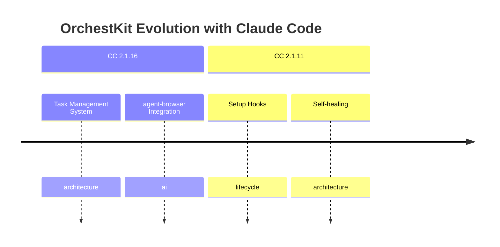

# Decision History Dashboard

Visualize how OrchestKit evolved with Claude Code versions, understand WHY decisions were made, and track best practices adoption.

## Overview

- View architecture decisions chronologically
- Track Claude Code version evolution (2.1.0 → 2.1.16+)
- Understand rationale behind each decision
- Generate Mermaid timeline diagrams for docs
- Query decisions by category, CC version, or date range

## Quick Start

```bash
# List recent decisions
node hooks/bin/decision-history.mjs list

# Show decisions for specific CC version
node hooks/bin/decision-history.mjs list --cc-version 2.1.16

# Generate Mermaid timeline
node hooks/bin/decision-history.mjs mermaid --output timeline.md

# Filter by category
node hooks/bin/decision-history.mjs list --category security

# Show last 30 days
node hooks/bin/decision-history.mjs list --days 30

# View statistics
node hooks/bin/decision-history.mjs stats

# Search decisions
node hooks/bin/decision-history.mjs search "typescript hooks"
```

## Data Sources

Decisions are aggregated from multiple sources (priority order):

| Source | Location | Description |
|--------|----------|-------------|
| Session | `.claude/context/knowledge/decisions/active.json` | Recent in-session decisions |
| CHANGELOG | `CHANGELOG.md` | Parsed version history |
| Coordination | `.claude/coordination/decision-log.json` | Multi-instance decisions |

## CLI Commands

```bash
# List decisions with filters
decision-history list [--cc-version VER] [--category CAT] [--days N] [--limit N]

# Show decision details
decision-history show <decision-id>

# Display timeline view
decision-history timeline [--group-by cc_version|category|month]

# Show statistics
decision-history stats

# Generate Mermaid diagram
decision-history mermaid [--output FILE] [--full] [--group-by FIELD]

# Sync from all sources (refresh cache)
decision-history sync

# Search decisions
decision-history search <query>
```

## Output Formats

### ASCII Table (Default)

```
┌────────────┬──────────┬────────────────────────────────────────────┬────────────┐
│ Date       │ CC Ver   │ Summary                                    │ Category   │
├────────────┼──────────┼────────────────────────────────────────────┼────────────┤
│ 2026-01-21 │ 2.1.16   │ **CC 2.1.16 Support**: Full Claude Code... │ architectu │
│ 2026-01-18 │ 2.1.16   │ **New agent-browser Skill** - Complete V...│ ai         │
│ 2026-01-18 │ 2.1.16   │ **Hook Stdin Consumption** - Fixed 39 ho...│ hooks      │
└────────────┴──────────┴────────────────────────────────────────────┴────────────┘
```

### ASCII Timeline

```
Decision History Timeline
════════════════════════════════════════════════════════════════

CC 2.1.16
  ├── 2026-01-21 ── CC 2.1.16 Support: Full integration
  │   HIGH │ architecture
  ├── 2026-01-18 ── New agent-browser Skill
  │   MEDIUM │ ai

CC 2.1.11
  ├── 2025-12-20 ── Setup Hooks for Initialization
  │   HIGH │ lifecycle
```

### Mermaid Timeline



## Decision Schema

Each decision includes:

```typescript
interface Decision {
  id: string;              // e.g., "4.28.0-architecture-1"
  date: string;            // ISO date: "2026-01-21"
  summary: string;         // Brief description
  rationale?: string;      // Full explanation
  ccVersion?: string;      // e.g., "2.1.16"
  pluginVersion?: string;  // e.g., "4.28.0"
  category: string;        // e.g., "architecture", "security"
  impact: 'high' | 'medium' | 'low';
  status: 'proposed' | 'implemented' | 'deprecated' | 'superseded';
  source: 'changelog' | 'session' | 'coordination' | 'mem0';
  bestPractice?: string;   // Related best practice
  entities?: string[];     // Related concepts
}
```

## Implementation

This skill is implemented in TypeScript as part of the hooks infrastructure:

| File | Purpose |
|------|---------|
| `hooks/src/lib/decision-history.ts` | Core module (parser, aggregator, formatters) |
| `hooks/bin/decision-history.mjs` | CLI entry point |
| `hooks/dist/hooks.mjs` | Bundled module (via esbuild) |

### Key Functions

- `parseChangelog(content)` - Parse CHANGELOG.md into structured data
- `aggregateDecisions()` - Combine all sources with deduplication
- `filterDecisions(decisions, options)` - Apply CC version, category, date filters
- `formatTable(decisions)` - ASCII table output
- `formatTimeline(decisions)` - ASCII timeline grouped by version
- `formatMermaid(decisions)` - Mermaid diagram generation
- `formatStats(aggregated)` - Statistics summary

## Key Decisions

| Decision | Choice | Rationale |
|----------|--------|-----------|
| Language | TypeScript ESM | Consistent with hooks migration, type safety |
| CLI pattern | Node.js script | Same as hooks infrastructure |
| Timeline format | Mermaid | GitHub-native, docs-friendly |
| Data aggregation | Multi-source | CHANGELOG + session + coordination |
| Caching | File-based | `.claude/feedback/changelog-decisions.json` |

## References

- [CLI Commands](references/cli-commands.md) - Detailed command reference
- [Data Schema](references/data-schema.md) - Full schema specification
- [CC Version Mapping](references/cc-version-mapping.md) - Feature to CC version map

## Related Skills

- release-management: Version tracking and changelog generation
- context-compression: Context management patterns
- mem0-memory: Memory CRUD operations (optional integration)
